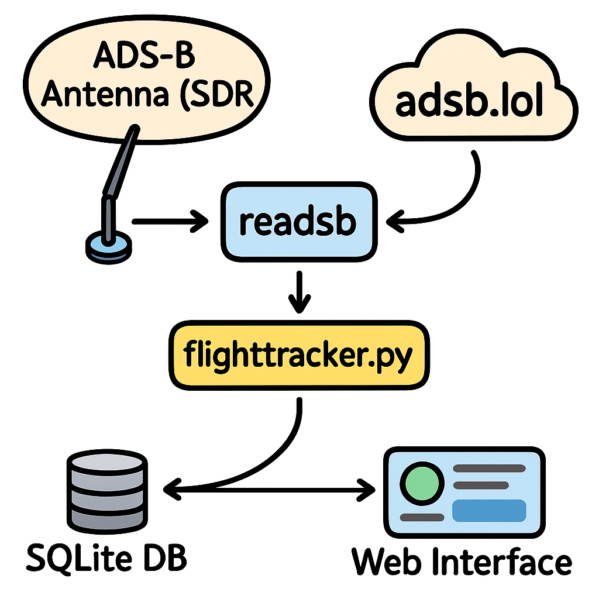

# ✈️ Landetracker – ADS-B Flugüberwachung für Raspberry Pi

**Landetracker** ist ein leichtgewichtiger Flugtracker für den Raspberry Pi. Er verbindet lokale ADS-B-Daten von `readsb` mit einer Weboberfläche zur Anzeige von Platzrunden, Flugbewegungen, Statistiken und mehr.

---

## 📦 Voraussetzungen

* Raspberry Pi OS (empfohlen: Lite, 64bit)
* Internetverbindung für Erstinstallation
* Python 3, SQLite3, `lighttpd`
* Lokale ADS-B-Daten via `readsb`, optional kombiniert mit Online-Daten von adsb.lol

---

## 🚀 Installation

### 1. Repository klonen

```bash
git clone https://github.com/AndreasS964/Landetracker.git
cd Landetracker
```

### 2. aircraftDatabase.csv übertragen

> 🔁 Per SFTP oder SCP ins Projektverzeichnis kopieren:

```bash
scp aircraftDatabase.csv pi@<IP>:/home/pi/Landetracker/
```

### 3. Installer vorbereiten

```bash
chmod +x install_flighttracker.sh
```

### 4. Installer ausführen

```bash
sudo -i
cd /home/pi/Landetracker
./install_flighttracker.sh
```

> 🧠 **Wichtig:** `install_flighttracker.sh` muss in einem **interaktiven Terminal** laufen! Nie über `sudo ./install_flighttracker.sh` direkt starten – nutze `sudo -i` stattdessen.

---

## 🖼️ Systemübersicht



## 🌐 Webinterface

* **Startseite:** `http://<IP>/flugtracker/`
* **Status:** `http://<IP>/flugtracker/status.html`
* Anzeige aller Flugzeuge inkl. Platzrunde (aus `platzrunde.gpx`)

---

## ⚙️ Features

* ✅ lokale Speicherung aller Flüge in SQLite
* ✅ Darstellung über Lighttpd + Leaflet
* ✅ Platzrunde via GPX-Datei
* ✅ aircraftDatabase-Support für Flugzeugmuster
* ✅ Statistik, Filter, Geschwindigkeitstabelle
* ✅ Unterstützt `readsb`, adsb.lol, tar1090, graphs1090

---

## 🧪 Entwickler / Debug

* Logdatei: `/var/log/flugtracker/debug.log`
* Datenbank: `/var/lib/flugtracker/flugdaten.db`
* Service: `sudo systemctl status flugtracker`

---

## 🛠 Update

Bei vorhandener Installation einfach:

```bash
cd ~/Landetracker
git pull
sudo -i
cd /home/pi/Landetracker
./install_flighttracker.sh
```

---

## 📘 Lizenz

MIT-Lizenz – freie Nutzung, Anpassung & Weitergabe erwünscht ✌️
